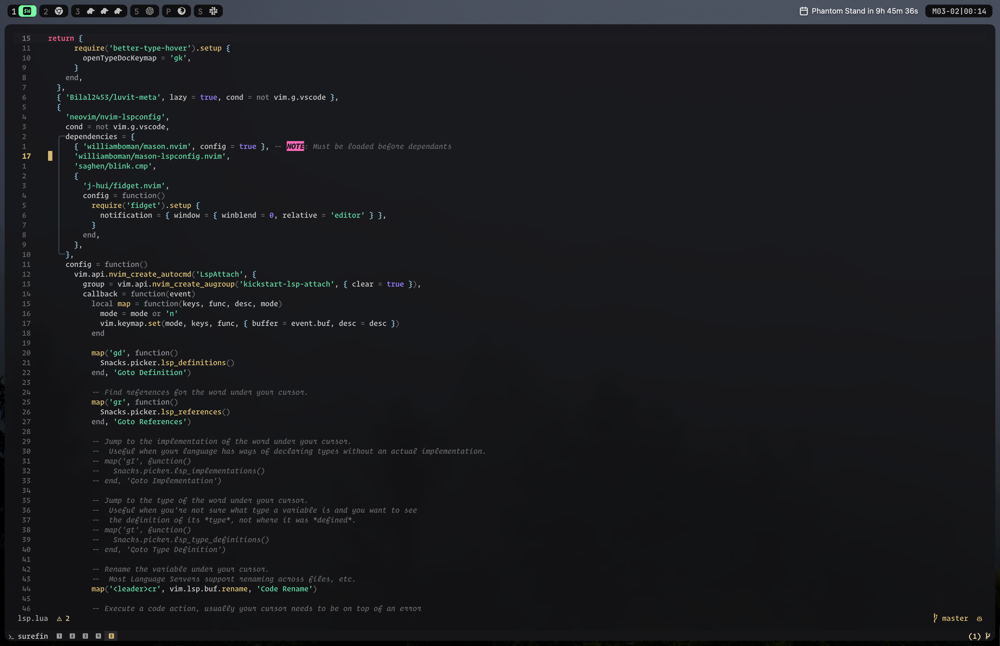

# schester's dotfiles

My macOS development environment — Neovim, WezTerm, zsh, and more.



## What's Inside

| Tool | Description |
|------|-------------|
| **[nvim](nvim/)** | Neovim config with lazy.nvim, LSP, Treesitter, and 40+ plugins |
| **[wezterm](wezterm/)** | GPU-accelerated terminal with custom grapelean theme |
| **[zsh](zsh/)** | Shell config with oh-my-zsh and custom functions |
| **[aerospace](aerospace/)** | Tiling window manager for macOS |
| **[sketchybar](sketchybar/)** | Custom macOS menu bar |
| **[lazygit](lazygit/)** | Git TUI with nvim integration |
| **[git](git/)** | Git config and global gitignore |
| **[raycast](raycast/)** | Launcher scripts and extensions |
| **[colors](colors/)** | Grapelean color scheme definition |

## Theme: Grapelean

A custom dark theme with a gray base and pink, purple, and green accents. Applied across Neovim, WezTerm, and Sketchybar for a consistent look.

## Quick Start

```bash
# Clone the repo
git clone https://github.com/schester44/dotfiles ~/.dotfiles
cd ~/.dotfiles
```

### Prerequisites

1. **Xcode Command Line Tools**
   ```bash
   xcode-select --install
   ```

2. **Homebrew** — [brew.sh](https://brew.sh)
   ```bash
   /bin/bash -c "$(curl -fsSL https://raw.githubusercontent.com/Homebrew/install/HEAD/install.sh)"
   ```

### Symlink Configs

```bash
# Create config directories
mkdir -p ~/.config/lazygit

# Symlink everything
ln -s ~/.dotfiles/nvim ~/.config/nvim
ln -s ~/.dotfiles/wezterm ~/.config/wezterm
ln -s ~/.dotfiles/aerospace ~/.config/aerospace
ln -s ~/.dotfiles/sketchybar ~/.config/sketchybar
ln -s ~/.dotfiles/lazygit/config.yml ~/.config/lazygit/config.yml
```

### Zsh Setup

```bash
# Install oh-my-zsh, then symlink .zshrc
sh -c "$(curl -fsSL https://raw.github.com/ohmyzsh/ohmyzsh/master/tools/install.sh)"
ln -s ~/.dotfiles/zsh/zshrc.symlink ~/.zshrc
```

### Fonts

Unzip `fonts.zip` and install the fonts to your system.

## macOS Preferences

A few settings I always change:

- **Dock**: Auto-hide, disable "Show recent applications"
- **Trackpad**: Enable tap to click
- **Raycast**: Hide menu bar icon

---

Feel free to explore and steal what's useful. These are tailored to my workflow but might give you some ideas for your own setup.
